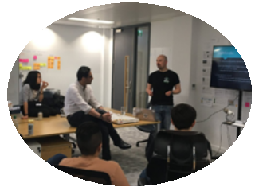
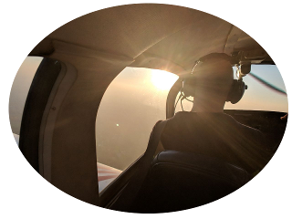

## whoami

I'm *Konrad Strachan* and I have been writing code since I was 7 years old.

Back then waiting **several minutes** for a game to load from a tape cassette on my [Amstrad CPC 464](http://www.computinghistory.org.uk/det/2805/Amstrad-CPC-464/) felt like an eternity and I opted instead to pick up the [thick and colourful programming guide](https://lh3.googleusercontent.com/proxy/Oh-u9qjVUXRu4JTeeWaQ1TLn8pF71VymXqLiasxwowI6KLrJTwhjuKIgy_ogEqV4cxaPnWew5mKeXgSiaMuaUWdGlwNGgb5bORVvYw) that came with the machine to see how I could create my own programs (without waiting). It was a time before the Internet, when computer magazines were replete with [code listings](https://arstechnica.com/staff/2018/11/first-encounter-compute-magazine-and-its-glorious-tedious-type-in-code/) enterprising readers could tediously type in to their machines.

This early curiosity and exposure to programming sparked my passion for software development and technology in general which continues to this day.

Fast forward to today, and I would describe myself as someone who loves solving problems, collaborating with others, is comfortable leading teams as well and writing code in a variety of languages. The majority of my career thus far has been spent writing *modern C++* and whilst *Golang* is a relatively recent addition to my skillset it is (with C++) one of my preferred languages to develop in.

I am a firm advocate of the [KISS principle](https://en.wikipedia.org/wiki/KISS_principle) and believe the real skill in software development is condensing complex logical constructs into cleanly designed, self documenting and easily maintainable code.

Aside from writing code, I love talking about problems I've solved, sharing knowledge and presenting information. Teaching others is often the best way to master a subject yourself.

In my career thus far I have had the privilege of working for a global provider of financial markets data, a Cryptocurrency market data firm as well as the leading supplier of remote control and security software. 

Further information about my professional experience over the last 10+ years can be found on my [LinkedIn](https://www.linkedin.com/in/konrad-strachan/) and also on my [CV](KonradStrachanCV2020.pdf) which is also available.

When I'm not writing code I like to be up in the sky flying light aircraft like [Piper PA-28s](https://en.wikipedia.org/wiki/Piper_PA-28_Cherokee) or [Grumman AA-5Bs](https://en.wikipedia.org/wiki/Grumman_American_AA-5).

## Skills and technologies

        

* I have a strong passion for **Modern C++ (11/14/17)** and have spent a more than 10 years contributing to professional and hobby code bases

* **Golang** is a more recent interest of mine, having only used it professionally for about a year now. In that time it has won me over allowing for rapid development and solving of problems whilst retaining the power and performance of a strong statically typed compiled lanugage

* **JavaScript** is a wonderfully flexible language that I have used over many years both on the front end and more recently on the backend with the wonderful **NodeJS**

* Lastly but by no means leastly I have used **Python** extensively over the last 10 years for everything from scripting to microservice deployment

## Platforms I have developed for

     

### Windows 
* GUI using Win32 and MFC
* Windows Services
* User authentication integrations
* Terminal Services (RDP and TS) extensions
* Text to Speech APIs
* Low level integration with other fundamental Windows technologies

### Linux 
* High performance low latency Services
* Distributed microservice architecture
* GTK and QT libraries for GUI development

### Wearables
* Watchface and App development for Pebble and Fitbit smartwatches

## Technologies I am familiar with and other skills

Below is a non-exhaustive list of techniques, technologies or general areas I have had exposure to and consider myself comfortable with.

* Multithreaded, asynchronous processing and low latency development
* REST, Websocket and general web technologies (integration and implementation)
* Blockchain fundamentals and cryptocurrency consensus, proof of work/stake technologies
* Elektron APIs for Refinitiv integrations (Thomson Reuters)
* Boost C++ library 
* Boost ASIO based networking and threading models
* RapidJSON C++ libraries
* [FIX protocol](https://en.wikipedia.org/wiki/Financial_Information_eXchange)
* QuickFIX C++ libraries
* Distributed, decentralized high performance messaging (NSQ)
* [S.M.A.R.T.](https://en.wikipedia.org/wiki/S.M.A.R.T.) (Self-Monitoring, Analysis and Reporting Technology) technologies
* Binary protocol and file format design and implementation
* Low level protocol analysis
* Microcontroller based hardware interfacing

## Selected open source projects

Whilst the majority of the code I write is proprietary, I have been increasingly trying to open source smaller hobby or prototype projects I have worked on of late.

* High performance spot market matching engine written in C++17 [MatchingEngine](https://github.com/konradstrachan/MatchingEngine)
* Experimental [console framebuffer output](https://github.com/konradstrachan/ConsoleExperiments) written in C++17 
* Popular Pebble [smartwatch watchface called AcitivityFace](https://github.com/konradstrachan/Pebble_ActivityWatchFace) written in C and Javascript
* Simple Windows tool to [switch between Cryptocurrency miners based](https://github.com/konradstrachan/miningswitcher) on profitibility written in C++14 
* Simple isometric game called [Hopper](https://github.com/konradstrachan/Pebble_HopperGame) for Pebble smartwatches written in C 