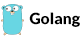
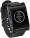
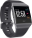

# whoami

I'm *Konrad Strachan* and I have been writing code since I was 7 years old.

Back then waiting several minutes for a game to load from a tape cassette on my [Amstrad CPC 464](http://www.computinghistory.org.uk/det/2805/Amstrad-CPC-464/) felt like an eternity and I opted instead to pick up the programming user guide that came with the machine to see how I could create my own programs (without waiting).

This early curiosity sparked my passion for software development and technology in general. 

I love solving problems, collaborating, leading teams and writing code, especially using *modern C++* and *Golang*.

In my career thus far I have worked for a global provider of financial markets data, a Cryptocurrency market data firm as well as the leading supplier of remote control and security software. Further information about my professional experience over the last 10+ years can be found on my [LinkedIn](https://www.linkedin.com/in/konrad-strachan/).

When I'm not writing code I like to be up in the sky flying light aircraft like Piper PA-28s or Grumman AA-5Bs.

## Skills and technologies

        

* I have a strong passion for **Modern C++ (11/14/17)** and have spent a large number of years contributing to professional and hobby code bases

* **Golang** is a more recent interest of mine, having only used it professionally for about 6 months now. In that time it has won me over allowing for rapid development and solving of problems whilst retaining the power and performance of a strong statically typed compiled lanugage

* **JavaScript** is a wonderfully flexible language that I have used over many years both on the front end and more recently on the backend with the wonderful **NodeJS**

* Lastly but by no means leastly I have used **Python** extensively over the last ten years for everything from scripting to microservice deployment

## Platforms I have developed for

     

### Windows 
* GUI using Win32 and MFC
* Windows Services
* User authentication integrations
* Terminal Services (RDP and TS) extensions
* Text to Speech APIs
* Low level integration with other fundamental Windows technologies

### Linux 
* High performance low latency Services
* Distributed microservice architecture
* GTK and QT libraries for GUI development

### Wearables
* Watchface and App development for Pebble and Fitbit smartwatches

## Technologies I am familiar with and other skills

* Multithreaded, asynchronous processing and low latency development
* REST, Websocket and general web technologies (integration and implementation)
* Blockchain fundamentals and cryptocurrency consensus, proof of work/stake technologies
* Elektron APIs for Refinitiv integrations (Thomson Reuters)
* Boost C++ library (ASIO based networking and threading)
* RapidJSON C++ libraries
* FIX protocol
* QuickFIX C++ libraries
* Distributed, decentralized high performance messaging (NSQ)
* S.M.A.R.T. (Self-Monitoring, Analysis and Reporting Technology) integration
* Binary protocol and file format design and implementation
* Low level protocol analysis
* Microcontroller based hardware interfacing

## Selected open source projects

* High performance spot market matching engine written in C++17 [MatchingEngine](https://github.com/konradstrachan/MatchingEngine)
* Experimental [console framebuffer output](https://github.com/konradstrachan/ConsoleExperiments) written in C++17 
* Popular Pebble [smartwatch watchface called AcitivityFace](https://github.com/konradstrachan/Pebble_ActivityWatchFace) written in C and Javascript
* Simple Windows tool to [switch between Cryptocurrency miners based](https://github.com/konradstrachan/miningswitcher) on profitibility written in C++14 
* Simple isometric game called [Hopper](https://github.com/konradstrachan/Pebble_HopperGame) for Pebble smartwatches written in C 